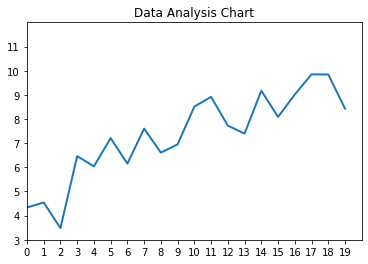

# Interesting Data Analysis


```python
import numpy as np
import matplotlib.pyplot as plt
```


```python
x = np.arange(0, 20, 1)
```


```python
y = np.arange(5, 10, .25) + np.random.normal(size=20)
```


```python
fig, ax = plt.subplots()

ax.plot(x, y, linewidth=2.0)

ax.set(xlim=(0, 20), xticks=np.arange(0, 20),
       ylim=(3, 12), yticks=np.arange(3, 12))

plt.title('Data Analysis Chart')

plt.show()
```





```python

```
